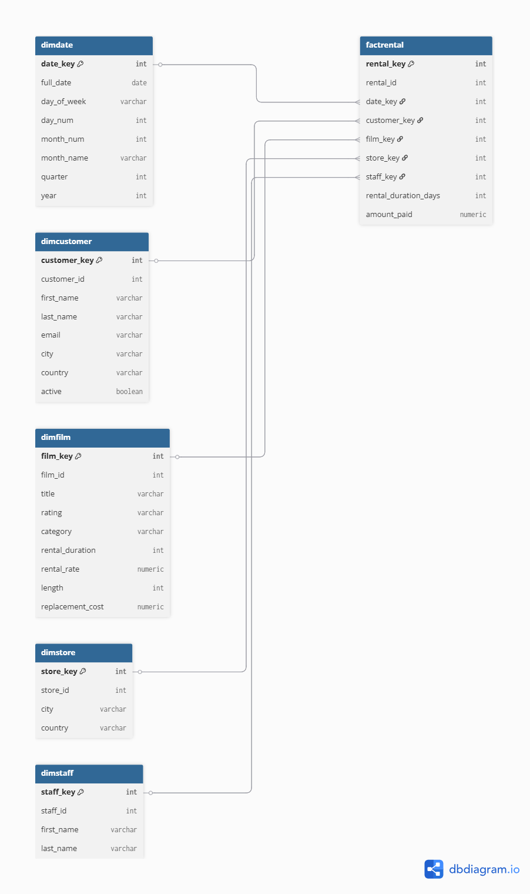
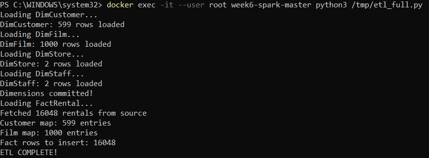
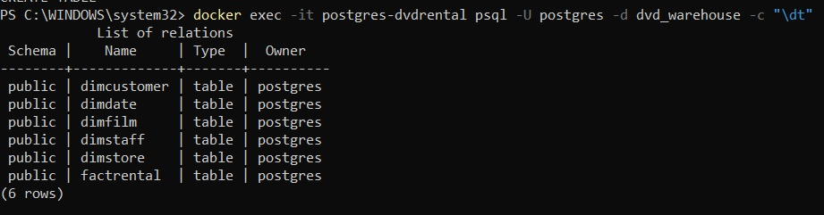
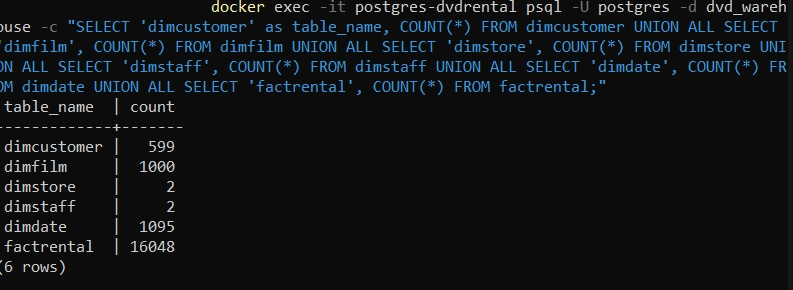
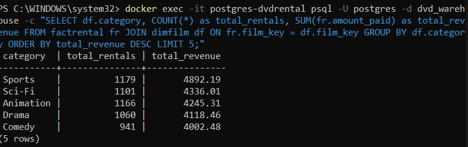
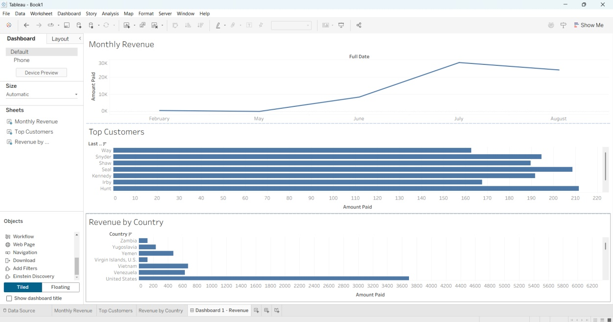
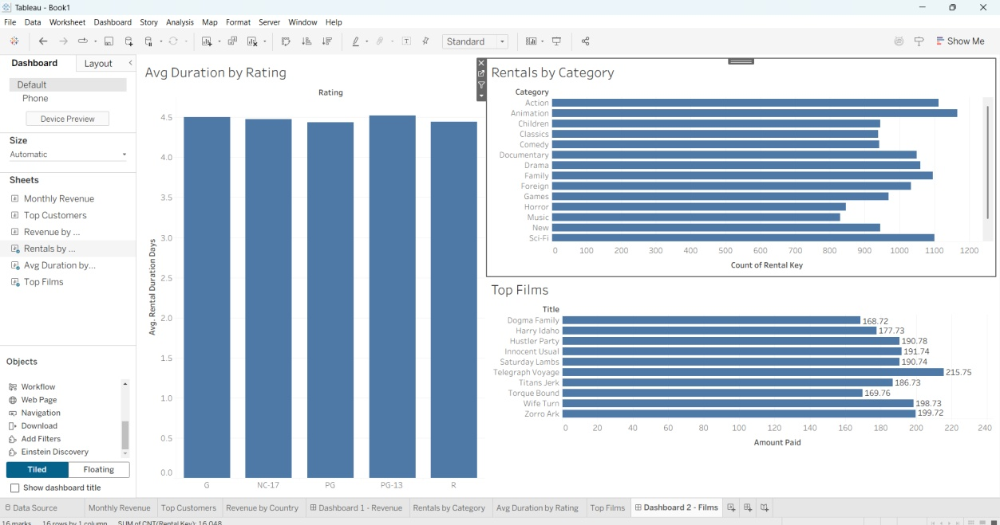
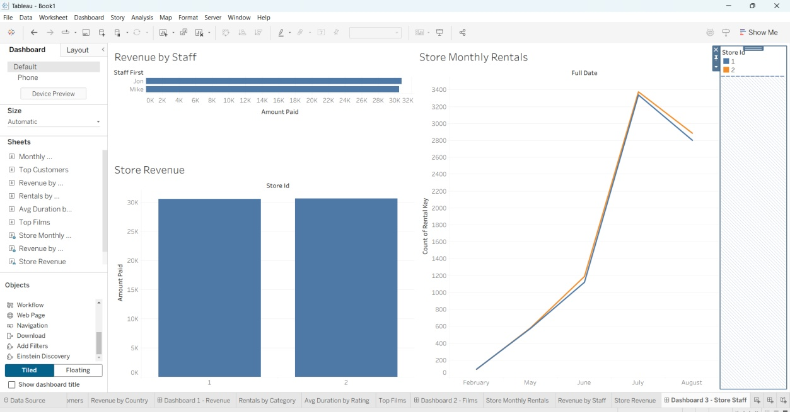
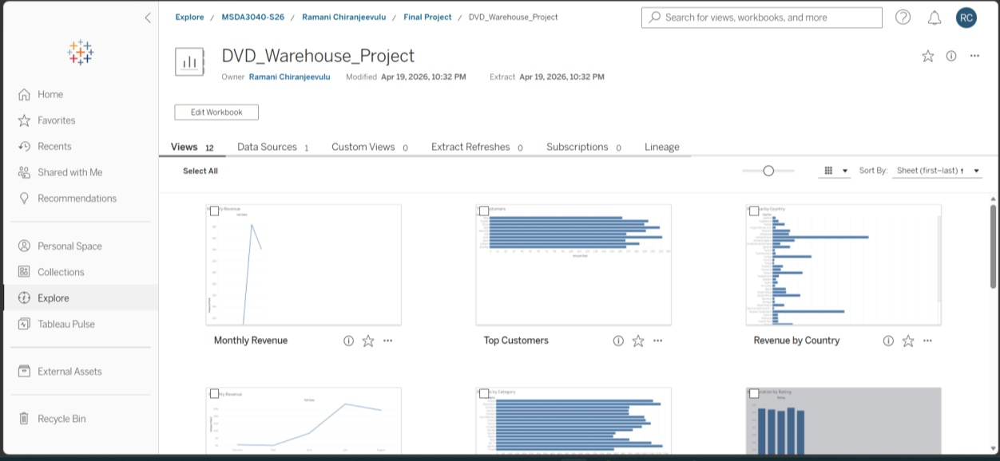

# 🎬 DVD Rental Data Warehouse
### End-to-End ETL Pipeline + Star Schema + Tableau Dashboards


🔗 **[Live Tableau Dashboard](https://10ay.online.tableau.com/#/site/shashayu/workbooks/3828323/views)**

---

## 📌 Overview

Designed and built a complete data warehouse solution transforming a normalized **dvdrental OLTP** database into an optimized **OLAP star schema** data warehouse. Wrote a Python ETL pipeline to extract, transform, and load 16,048 rental records, then published 3 interactive Tableau dashboards to Tableau Online.

---

## 🏗️ Architecture

| Component | Tool |
|---|---|
| Source Database | PostgreSQL 13 (dvdrental — Docker) |
| Target Warehouse | PostgreSQL 13 (dvd_warehouse — Docker) |
| ETL Language | Python 3 + psycopg2 |
| Container Platform | Docker Desktop |
| Visualization | Tableau Desktop + Tableau Online |
| Schema Pattern | Star Schema (1 fact + 5 dimensions) |

---

## 📐 Star Schema Design



**Fact Table:** `FactRental` — 16,048 rental transactions

**Dimension Tables:**
| Table | Records | Description |
|---|---|---|
| `DimDate` | 1,095 | Date attributes (2005–2007) |
| `DimCustomer` | 599 | Customer demographics |
| `DimFilm` | 1,000 | Film attributes and categories |
| `DimStore` | 2 | Store locations |
| `DimStaff` | 2 | Staff members |

---

## ⚙️ ETL Pipeline

### How it works



The pipeline follows a 10-step ETL process:

1. Connect to source `dvdrental` and target `dvd_warehouse` simultaneously
2. Create star schema tables with foreign key constraints
3. Load all 5 dimension tables
4. Build Python dictionaries mapping natural keys → surrogate keys
5. Extract 16,048 rental records from source
6. Map all foreign keys using in-memory lookup dictionaries
7. Load `FactRental` with all mapped keys
8. Commit and verify row counts

### Tables loaded successfully





### Test JOIN query — warehouse relationships verified



---

## 📊 Tableau Dashboards

Connected Tableau Desktop to a fully denormalized CSV export (16,048 rows, 20 fields) from PostgreSQL, then published all 3 dashboards to Tableau Online.

### Dashboard 1 — Revenue & Customer Analysis



**Key insights:**
- Revenue peaked in July 2005 at ~$30,000
- Top customer (Seal) generated over $210 in total spending
- United States is the highest revenue country with $3,500+

---

### Dashboard 2 — Film & Inventory Analysis



**Key insights:**
- Animation and Sports are the most rented categories (1,100+ rentals each)
- Average rental duration is ~4.5 days across all ratings
- Telegraph Voyage is the highest earning film at $215.75

---

### Dashboard 3 — Store & Staff Performance



**Key insights:**
- Both stores follow nearly identical rental volume trends
- Jon and Mike each generated ~$30,000 in total revenue
- Store 1 and Store 2 generate approximately equal revenue

---

### Tableau Online Publication



🔗 **[View Live Dashboards](https://10ay.online.tableau.com/#/site/shashayu/workbooks/3828323/views)**

---

## 🔧 Technical Challenges Solved

| Challenge | Solution |
|---|---|
| PostgreSQL cross-database queries not supported | Used Python psycopg2 with two simultaneous connections |
| Python not available in PostgreSQL Docker container | Ran ETL from Spark container using container IP address |
| PowerShell heredoc formatting issues | Used `Set-Content` cmdlet to write Python script to file |
| Tableau Desktop couldn't connect to PostgreSQL | Exported denormalized CSV via PostgreSQL COPY command |

---

## 🚀 How to Run

### Prerequisites
- Docker Desktop installed
- dvdrental PostgreSQL database running in Docker
- Python 3 with psycopg2 installed

### Steps

```bash
# Install psycopg2
pip install psycopg2-binary

# Run the full ETL pipeline
python etl_full.py

# Verify row counts in dvd_warehouse
docker exec -it postgres-dvdrental psql -U postgres -d dvd_warehouse -c "
SELECT 'dimcustomer' as table_name, COUNT(*) FROM dimcustomer
UNION ALL SELECT 'dimfilm', COUNT(*) FROM dimfilm
UNION ALL SELECT 'dimstore', COUNT(*) FROM dimstore
UNION ALL SELECT 'dimstaff', COUNT(*) FROM dimstaff
UNION ALL SELECT 'dimdate', COUNT(*) FROM dimdate
UNION ALL SELECT 'factrental', COUNT(*) FROM factrental;"
```

---

## 📁 Repository Structure

```
dvd-rental-data-warehouse/
├── etl_full.py          # Complete ETL pipeline (Docker version)
├── etl.py               # ETL pipeline (local version)
├── fact.py              # FactRental loader script
├── dvd_warehouse.csv    # Denormalized export (16,048 rows, 20 fields)
├── images/              # Pipeline and dashboard screenshots
└── README.md
```

---

## 📚 Tech Stack

`Python` `psycopg2` `PostgreSQL` `Docker` `Star Schema` `ETL` `Tableau` `OLAP` `OLTP` `Data Warehousing` `SQL` `Business Intelligence`

---


